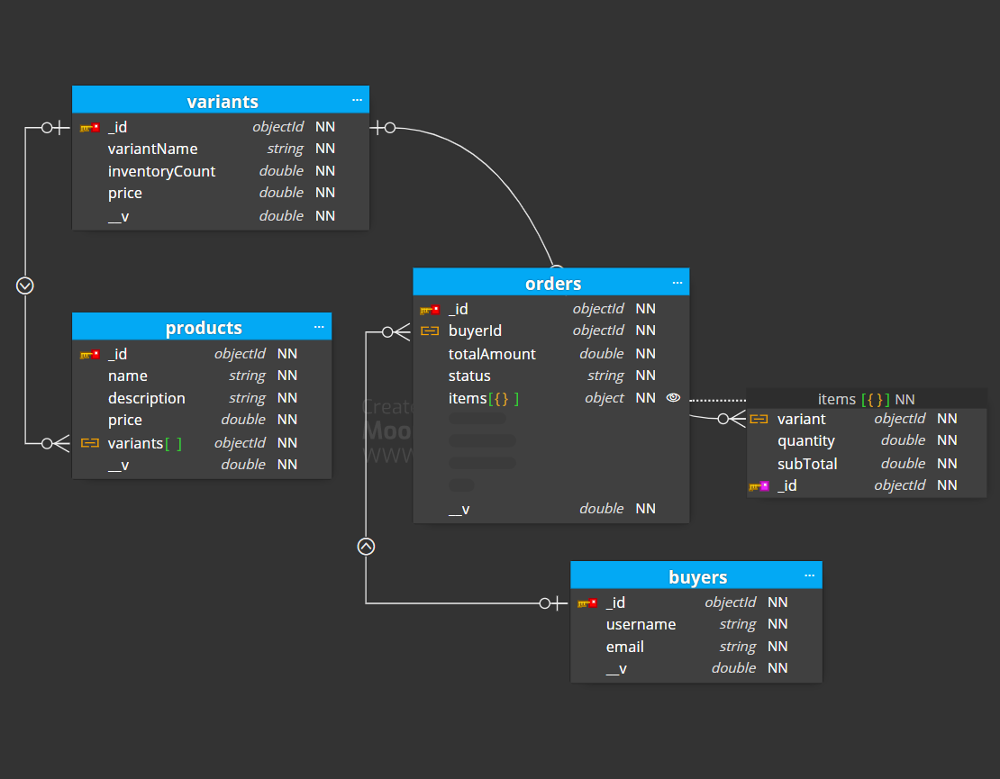

# GraphQL API with MongoDB

This project demonstrates a simple GraphQL API using Nodejs , ExpressJs and MongoDB with Mongoose.

## Installation

Clone the repository:

   bash
   git clone [https://github.com/Shubham-thakur282/ecommerce-graphql-api.git](https://github.com/Shubham-thakur282/ecommerce-graphql-api.git)

Install Dependencies
    cd your-repo
    npm install

Create .env file
    MONGO_URI=your-mongo-connection-string

Run Application 
    nodemon app.js
    node app.js
    npm start

## Usage

API provide following graphql queries and mutations.

## Queries

products : Get a list of products.
buyer(id):Get buyer details by ID.

## Mutations

createUser(userInput): Create a new user.
createProduct(productInput): Create a new product.
createOrder(createOrderInput): Create a new order.
addProductToOrder(orderInput): Add a product to an existing order.
createVariant(variantInput): Create a new variant.

## GraphQL Schema

See [SCHEMA.md](SCHEMA.md) for the detailed GraphQL schema.

## Entity-Relationship (ER) Diagram

## Examples

Creating a User

mutation {
  createUser(userInput: {
    username: "john_doe",
    email: "john.doe@example.com"
  }) {
    id
    username
    email
  }
}

Creating an order

mutation {
  createOrder(createOrderInput: {
    buyerId: "buyer-id",
    items: [
      { variantId: "variant-id", quantity: 2, price: 600.00 },
    ]
  }) {
    id
    buyerId
    totalAmount
    status
    items {
      variant {
        id
        variantName
        price
      }
      quantity
      subTotal
    }
  }
}

